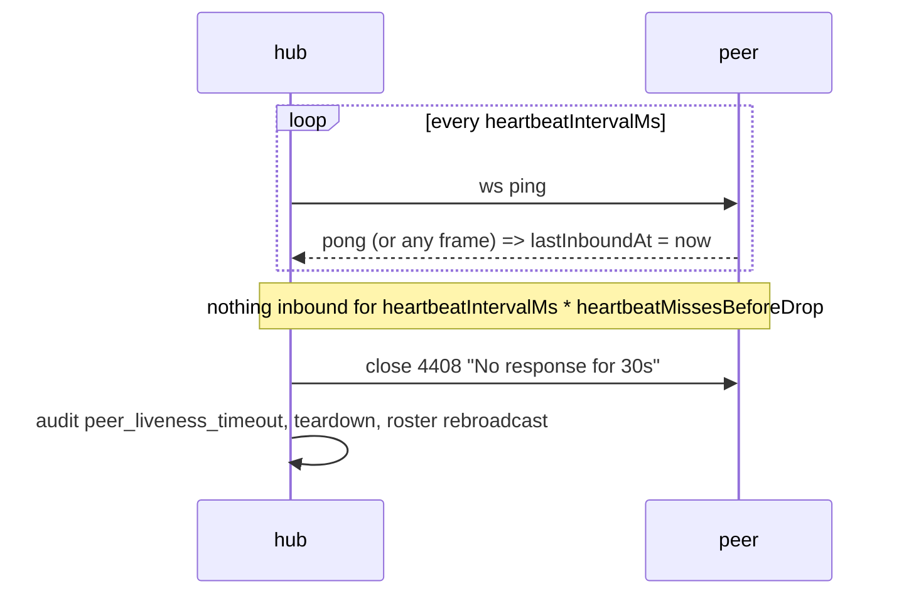

# Concepts

Four identities, one topology. Getting these straight explains almost every behaviour
that surprises people.

- [The four identities](#the-four-identities)
- [Device principal](#device-principal)
- [Agent instance](#agent-instance)
- [Workspace](#workspace)
- [Room](#room)
- [Why a room is not a name](#why-a-room-is-not-a-name)
- [The star topology, stated honestly](#the-star-topology-stated-honestly)
- [Where state lives on disk](#where-state-lives-on-disk)
- [Liveness and TTL](#liveness-and-ttl)
- [Configuration: `link.json`](#configuration-linkjson)
- [Connection phases](#connection-phases)

Related: [security.md](security.md), [scenarios.md](scenarios.md),
[../SECURITY.md](../SECURITY.md).

---

## The four identities

| Identity | Value | Bound to | Lifetime | On disk |
|---|---|---|---|---|
| Device principal | `${keyType}-sha256:${spkiFp}` | An X.509 keypair for one machine | Cert is issued for 3650 days; survives reboots and reinstalls of the agent | `<OMP_DIR>/identity/device-{cert,key}.pem` |
| Agent instance | `crypto.randomUUID()` | One running `LinkNode`, i.e. one terminal process | Process lifetime; a new uuid on every start | Nowhere — memory only |
| Workspace | An id string (`"default"`) → canonical root | A directory, canonicalised with `fs.realpathSync` | Process lifetime | Nowhere — `registeredWorkspaces` Map |
| Room | `crypto.randomUUID()` plus the hub's principal | The device that created it | Persisted; survives restarts | `<OMP_DIR>/link.json` → `rooms[]` |

These are never interchangeable. `AGENTS.md` invariant 9: *"`principalId` is a device, not
an agent."*

---

## Device principal

Created on first use by `getOrCreateDeviceIdentity` (`src/identity.ts`), which shells out
to `openssl req -x509 -newkey ed25519 -days 3650 -subj /CN=omp-link-device`, falling back
to `ec` / `prime256v1` if Ed25519 is unavailable. Both files are chmod `0600`, the
directory `0700`.

The principal is derived from the **SPKI**, not the certificate body:

```
principalId = `${keyType}-sha256:${fingerprintPublicKey(spkiDer)}`
```

`normalizeFingerprint` canonicalises to uppercase colon-separated hex, so a fingerprint
always matches `/^([0-9A-F]{2}:){31}[0-9A-F]{2}$/`.

Consequences worth internalising:

- **Every terminal on one machine shares one device principal.** Two OMP windows are the
  same device to the protocol.
- Pairing pins the *device*. Pair once per machine pair, not once per terminal.
- Deleting `<OMP_DIR>/identity/` gives the machine a new identity, and every peer that
  pinned the old one will refuse it with a pinning mismatch.
- `SECURITY.md` §7: local compromise of `<OMP_DIR>` defeats device identity. Everything
  else follows from that, including sibling admission.

## Agent instance

`LinkNode.agentInstanceId` — `public readonly agentInstanceId: string = crypto.randomUUID()`.
It travels on `client_hello` (validated by `parseWireMessage`: required, string, ≤ 64
chars), is stored on `ConnectionContext.agentInstanceId`, and appears in the roster as
`TerminalDescriptor.agentInstanceId`.

It exists because the device principal cannot distinguish two terminals on one machine.
Three places depend on that distinction:

| Use | Code |
|---|---|
| Exec grants are keyed `${principalId}::${agentInstanceId}` | `activeExecGrants`, `src/authorization.ts` |
| Duplicate display names are disambiguated only when the instance differs | `uniqueDisplayName`, called from `handleHubClientHello`, appends `@<6 hex>` and audits `display_name_collision` |
| A client filters itself out of the hub roster | `absorbRoster` drops `t.agentInstanceId === this.agentInstanceId` |

Revocation is deliberately asymmetric: `revokeGrantsForPrincipal(principalId)` with no
instance is device-wide (that is what unpairing wants), and passing an instance revokes
just that terminal.

## Workspace

A workspace is `{ id, canonicalRoot, allowMetadata, allowContentRead, allowDiffContent,
allowInboundFiles, allowExec }` (`WorkspacePolicy`, `src/inspection.ts`). `allowExec`
defaults `false`; the other four default `true`.

Registration happens in the `LinkNode` constructor:

```ts
registerWorkspace({ id: "default", rootDir: this.workspaceRoot });
```

with `workspaceRoot = options.workspaceRoot || process.cwd()`. Every inspection RPC
resolves its root through `getRegisteredWorkspace(req.params?.workspace || "default")`.

Two limitations to know before you rely on this:

1. **`default` is auto-registered from `process.cwd()`.** `getRegisteredWorkspace` will
   even create it on demand for the ids `default` and `*`. So the directory you launched
   the agent in is exported, whether you meant to export it or not.
2. **Nested repositories are not separated.** There is no `git rev-parse --show-toplevel`
   canonicalisation and no named-export command, so a repo inside your cwd is reachable
   through the parent's `default` export. See
   [scenarios.md#e-nested-repositories](scenarios.md#e-nested-repositories).

Confinement is still enforced per request: `resolveConfinedPath` rejects null bytes,
Windows drive prefixes, symlink escapes and traversal, and `isSensitivePath` blocks
`.env*`, `id_rsa`, `*.pem`, `*.key`, `.git`, `.ssh`, `credentials`, `kubeconfig`,
`*.tfvars` and more (`SENSITIVE_PATTERNS`, `src/inspection.ts`).

## Room

```ts
interface RoomRecord {
  roomId: string;          // opaque uuid
  label: string;           // human label, local only
  hubPrincipalId: string;  // who is allowed to be the host
  hubFingerprint: string;  // what to pin
  endpoint: string;        // "ip:port" last used
  lastJoinedAt: number;
}
```

Stored in `<OMP_DIR>/link.json` under `rooms[]`, with `currentRoomId` naming the active
one. Written through `saveConfig` (`src/config.ts`) → `atomicWriteSecureFile` (tmp +
`0600` + rename).

Three verbs, three distinct meanings, enforced in code:

| Verb | Behaviour |
|---|---|
| `/link create <name>` | Always creates. `initNode(undefined)` → `roomId = crypto.randomUUID()` |
| `/link join [endpoint]` | Never creates. Joins the room the endpoint already hosts |
| `/link on` | Only resumes a remembered room. With none: `No room remembered on this machine.` |

`/link on` also has a smart local path: if a sibling terminal on this machine is already
hosting *this exact* `roomId` (probed via `GET /status` on `127.0.0.1:9900`), it joins that
instead of racing for the port.

## Why a room is not a name

The label never reaches the wire. Grep the publishing sites:

- `server_hello` carries `roomId`, `hubPrincipalId`, `hubFingerprint`, `hubNonce`,
  `requiresPairing`, `host`, `terminals` — no label.
- `GET /status` returns `{service, protocolVersion, roomId, spkiFingerprint,
  certificateFingerprint, principalId, pairingAvailable, transport}` — no label, no
  terminal name, no cwd.

If a name were the identity, then:

- Two machines that both run `/link create backend` would appear to be in one room. They
  are not: two `roomId`s, two hub principals.
- "Join backend" would be a request to trust whoever answers to that name — exactly the
  substring-match-on-a-name trust path that `SECURITY.md` §9 forbids.

So a room is the pair `(roomId, hub principalId)`. `roomId` says *which* room;
`hubPrincipalId` says *who is allowed to be its host*. `/link on` uses both: it re-hosts
when `currentRoom.hubPrincipalId === node.identity.principalId`, and otherwise rejoins
`currentRoom.endpoint` pinned to `currentRoom.hubFingerprint`.

The label is only ever rendered locally — in the status card, `/link peers` and the
`sessionId` passed to `LinkNode` (which is used for the inbox subdirectory name).

## The star topology, stated honestly


**The hub terminates TLS and reads everything.** There is no client-to-client encryption
layer. `routeApplicationMessage` parses each frame, decides whether it is for the hub or a
peer, and writes it out on the target's own TLS socket. A chat message from B to C exists
in plaintext inside the hub process. So does every `read_file` result and every 64 KiB
file chunk.

`omp-link doctor` prints this in every run rather than burying it:

```
  Note: the hub terminates TLS and routes every message. There is no client-to-client
  end-to-end encryption; see SECURITY.md section 1.
```

What the star *does* buy you:

- One listener, one port, no NAT traversal, no rendezvous server.
- The hub authenticates every peer itself, which is what makes origin attribution
  trustworthy. `bindMessageOrigin` overwrites the wire `from` with the TLS-authenticated
  identity, and `attributeOrigin` deliberately does **not** do this on a client — a client's
  only peer is the hub, so rewriting would relabel all relayed traffic as coming from the
  hub (`AGENTS.md` invariant 2).
- Being the hub is a role, not a permission. A hub's `read_file` against a client is
  authorized against the capabilities *that client* stored for it. Both roles run
  `gateInboundApplicationMessage`.

What it costs you: choose your host to be a machine you would trust with the contents of
the conversation, because it has them.

## Where state lives on disk

All under `<OMP_DIR>` (`$OMP_DIR`, else `~/.omp` if present, else `~/.pi` if present, else
`~/.omp`).

| Path | Contents | Mode |
|---|---|---|
| `identity/device-cert.pem` | X.509 device certificate | `0600` |
| `identity/device-key.pem` | Private key | `0600` |
| `identity/metadata.json` | `deviceName`, `createdAt`, `principalId`, `fingerprint` | `0600` |
| `paired-devices.json` | `{version: 3, devices: [...]}`; pinned SPKI + capabilities per device | `0600` |
| `paired-devices.lock` | Transient `wx` lock held across a load+write of the store, so two terminals cannot pair over each other | `0600` |
| `paired-devices.v<old>.bak.json` | Archived pre-v3 store; there is no migration | — |
| `link.json` | `configVersion`, `terminalName`, `network`, `currentRoomId`, `rooms[]`, `timings` | `0600` |
| `audit.log` | JSONL, one security decision per line | `0600` |
| `inbox/<workspace>/rx-<pid>-<rand>-XXXXXX/` | Quarantined received files, never the working tree | dir `0700`, staging file `0600` |

Secrets are written with `atomicWriteSecureFile` (temp file, `0600`, rename), never a bare
`writeFileSync`.

For an isolated experiment, point `OMP_DIR` at a scratch directory before launching the
agent — identity, pairings, inbox and audit log all follow it:

```bash
OMP_DIR=/tmp/link-experiment omp
```

## Liveness and TTL

Agents do not stay connected forever, and the answer to "is there a TTL" is yes on both
sides — one for the hub's view of a peer, one for a client's view of its hub. Both are
configuration, not constants.

Why it has to exist at all: a suspended process, a closed laptop lid or a dropped Wi-Fi
link leaves an established socket that neither end notices for minutes. A `SIGSTOP`ped
process still ACKs at the TCP layer, so nothing below the application can tell it apart
from an idle peer. Only an unanswered WebSocket ping can.



| Side | Timer | Default | What happens when it fires |
|---|---|---|---|
| Hub → peer | `heartbeatIntervalMs * heartbeatMissesBeforeDrop` | 15 s × 2 = 30 s | Close `4408 No response for <n>s`, audit `peer_liveness_timeout`, full teardown |
| Client → hub | `clientHubSilenceTimeoutMs` | 45 s | Audit `hub_liveness_timeout`, notify, move to `disconnected`, `terminate()` the socket |

Mechanics, from `sweepHubLiveness` / `sweepClientLiveness` (`src/link-node.ts`):

- Only **authenticated** connections are swept. A connection still in the handshake is the
  handshake deadline's business.
- Every sweep sends `socket.ping()`; `ws` answers an inbound ping itself, so a peer only
  stops ponging when its process is genuinely stuck.
- **Any inbound traffic counts** — a pong or any frame — by stamping
  `ConnectionContext.lastInboundAt`. A busy peer is never dropped for being busy.
- Because the check happens at sweep granularity, the worst-case detection budget is
  `heartbeatIntervalMs * (heartbeatMissesBeforeDrop + 1)`, i.e. 45 s at the defaults.
- A drop is not a special path: `dropHubConnection` writes the close frame, then runs the
  ordinary teardown — exec grants revoked, in-flight transfers and pending requests
  cleaned up, `peer_disconnected` audited, roster rebroadcast — and then `terminate()`s,
  because `ws` would otherwise hold an unanswered close for its own 30 s timeout and the
  roster must be honest before that.

**The client's deadline is deliberately longer than the hub's** (45 s vs 30 s). A client
that declares its hub dead moves to `disconnected`, and that transition is what fires
`onHubDisconnected` and therefore local hub succession
([scenarios.md#d-the-hosting-terminal-exits](scenarios.md#d-the-hosting-terminal-exits)).
A spurious takeover is worse than a slightly stale roster, so the side that can only be
wrong about *display* is allowed to be fast, and the side that can be wrong about *hosting*
is made slow.

**A reconnecting terminal does not appear twice.** A terminal that comes back after a
crash, a sleep or a flap presents the same `agentInstanceId`. Its previous connection may
still look alive to the hub, so `evictSupersededInstance` closes the older one with
`4409 Superseded by a newer connection from the same agent` and audits
`peer_connection_superseded`. Leaving it in place would double-count the agent in the
roster, split routing by display name, and keep the dead connection's exec grants.

## Configuration: `link.json`

`src/config.ts` is the single source of truth for both configuration and operational
tunables. **Timings are configuration now, not a recompilation**: the values below used to
be `const`s scattered across modules.

The file is `<OMP_DIR>/link.json` — inside a dot-directory, but not itself dotted — written
at `0600` through `atomicWriteSecureFile`. It is *state*, not a secret: losing it costs the
room list and the terminal name, nothing cryptographic.

```jsonc
{
  "configVersion": 1,               // CONFIG_SCHEMA_VERSION; absent in files written before 3.4.0's config pass
  "terminalName": "mac-studio",     // display name; --link-name still wins for one launch
  "network": "lan",                 // "lan" | "tailscale"
  "currentRoomId": "…uuid…",        // must match a rooms[] entry to be usable
  "rooms": [
    { "roomId": "…", "label": "backend", "hubPrincipalId": "…", "hubFingerprint": "…",
      "endpoint": "192.168.1.5:9900", "lastJoinedAt": 1757462400000 }
  ],
  "timings": { "heartbeatIntervalMs": 20000 }   // optional, per-key override of the defaults
}
```

### `timings`

Every key is a positive integer of milliseconds unless noted. A value below its floor is
raised to the floor; a typo must degrade to "slow", never to "unusable".

| Key | Default | Floor | Governs |
|---|---|---|---|
| `handshakeTimeoutMs` | 10 000 | 1 000 | TLS connected → authenticated or paired; exceeding it closes `4408 Handshake timeout (<n>s)` |
| `pairingWindowMs` | 60 000 | 5 000 | How long a pairing request waits for a human |
| `heartbeatIntervalMs` | 15 000 | 1 000 | Interval between liveness pings |
| `heartbeatMissesBeforeDrop` | 2 | 1 | Consecutive silent intervals tolerated (a count, not ms) |
| `clientHubSilenceTimeoutMs` | 45 000 | 1 000 | Client-side: hub silence that means the hub is gone |
| `rpcTimeoutMs` | 30 000 | 1 000 | Wait for a correlated `link_exec` / RPC response |
| `transferInactivityMs` | 30 000 | 1 000 | No chunk for this long fails a transfer |
| `transferAbsoluteMs` | 120 000 | 1 000 | Hard ceiling on one transfer, and the idle age before another process may reclaim an orphaned `.part` |
| `discoveryProbeMs` | 1 200 | 100 | Budget for one discovery sweep — `link_discover`, `/link scan`, and the scan inside `/link join` |
| `grantDefaultMs` | 600 000 | 1 000 | Lifetime of an exec grant when the approver gives none |

Every key is consumed at its call site: nothing in `src/` keeps a private copy of a value
that also lives here. The user-visible strings follow the setting, so a shortened handshake
deadline closes with `Handshake timeout (4s)`, not a stale `(10s)`.

Deliberately **not** configurable: chunk size, maximum file size, dedupe cache size,
rate-limit windows and the roster cap. Those are part of the wire contract or the security
model, and a config file must not be able to widen them.

### What validation does

`loadConfig()` never throws. Every failure mode degrades to defaults plus one
human-readable warning that names the next action, which `/link doctor` prints as
`config problem` and `link_status` returns as `configWarning`.

| Input | Result |
|---|---|
| File missing | Defaults, no warning. This is normal before the first room |
| Empty, not JSON, or not a JSON object | Defaults, warning naming the file and `delete the file to start clean` |
| Unreadable (permissions) | Defaults, warning naming the reason |
| `rooms` not a list | No rooms loaded, warning |
| A room record missing `roomId`, `hubPrincipalId`, `hubFingerprint` or `endpoint` | That record is skipped, the rest load, warning counts the skipped ones |
| A timing that is not a finite positive number | That key falls back to its default, **its neighbours are untouched**, warning names the rejected keys |
| A timing below its floor | Raised to the floor, silently |
| No `configVersion` (a pre-config-pass file) | Migrated silently and forward: its shape is a strict subset of v1, so there is nothing a warning could tell you to do |
| `configVersion` newer than this build | Preserved, not rewritten; values still validate individually; you are told once |

**Unknown keys are preserved.** Other tools write here, and `saveConfig` is a
read-modify-write that merges only the keys its caller owns, so a round trip never
amputates a key this build does not know about.

`getTimings()` caches per resolved state directory and `LinkNode` reads it once at
construction, so an edit to `link.json` takes effect the next time the terminal starts.

## Connection phases

`validateMessagePhase` (`src/connection-state.ts`) is the second gate after schema parsing.
Order is the security model: parse → phase → dedupe → capability → origin → route.

| Phase | Accepts | Rejects with |
|---|---|---|
| `tls-connected` | `client_hello`, `server_hello` (once), `pair_request` | `4403 Message "<t>" forbidden in phase "tls-connected" (expected hello)`; duplicate hello → `4400` |
| `awaiting-pairing` | `pair_verify`, `pair_response`, `pair_request` | any application frame → `4403 Application traffic strictly prohibited before device pairing approval` |
| `authenticated` | application frames only | handshake frame → `4400 Handshake frame "<t>" forbidden after connection is authenticated` |
| `closing` | nothing | `4403 Connection is closing` |

The handshake has `handshakeTimeoutMs` (10 s by default) to leave `tls-connected`, then the
socket closes `4408 Handshake timeout (<n>s)` with the configured value in the reason.
Pairing has `pairingWindowMs` (60 s by default); both live in
[Configuration](#configuration-linkjson). Dedupe keeps the last 1000 message ids per
connection. An authenticated connection is then held to the liveness deadlines above.

Close codes you will see in logs: `4400` schema/protocol, `4403` authorization/phase/SAS,
`4408` timeout (handshake, pairing, or a peer that stopped answering), `4409` frame too
large, pairing unsupported, or a connection superseded by the same agent reconnecting,
`4429` rate limit (60 connections/min per IP, 10 pairings/min per IP, pairing queue capped
at 16).
